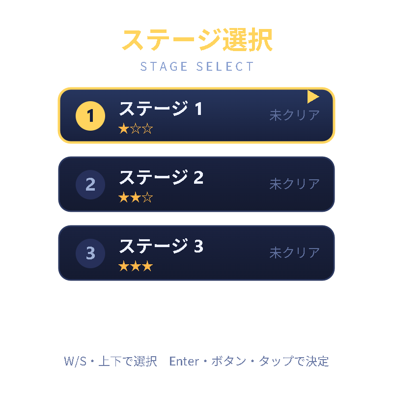

# MazeGame（迷路ゲーム）

Arduino UNO R4 WiFi を **Webサーバー**にして、PC・スマホのブラウザから遊べる **迷路ゲーム**。
このプロジェクトで最初に作った、基礎を固めるための作品です（完成）。

ゲーム本体（描画・ロジック）はブラウザ側の JavaScript（Canvas）。Arduino は HTML配信とジョイスティック値(`/state`)の応答だけを担当します。

  
  

## 主な機能
- 3ステージ（だんだん広く・複雑に）／クリアタイム計測／ベストタイム保存（localStorage）
- コイン集め：**全コイン取得でゴール（出口ポータル）が解放**（未取得は南京錠でロック表示）
- 敵キャラ（通路を巡回。接触でスタート地点に戻る）
- ステージ選択・クリア画面（カードUI）／ダンジョン風の見た目（石壁・床・光る金貨）

## 操作
| | 移動 | 決定 | リスタート |
|---|------|------|-----------|
| PC | WASD / 矢印（4方向） | Enter / Space | R |
| スマホ | タップ | タップ | （ステージ選択から） |
| 実機 | ジョイスティック上下左右 | ボタン押し込み | — |

> 斜め移動はしない**4方向**操作。キャラ（パックマン風）は進行方向を向きます。
> ハードが無くてもキーボード・タップで全機能が動作します。

## 配線（実機で遊ぶ場合）
| 部品 | Arduino |
|------|---------|
| ジョイスティック VRx / VRy / SW | A0 / A1 / D2（VCC→5V, GND→GND） |

> ブザー・LEDは使いません（効果音はブラウザの Web Audio で再生）。

## ビルド
1. リポジトリ直下の `arduino_secrets.h.example` を `arduino_secrets.h` にコピーし、このフォルダに置いてWi-Fi（2.4GHz帯）情報を記入。
2. `MazeGame.ino` ＋ `maze_gz.h` ＋ `arduino_secrets.h` を同じフォルダに置いて Arduino IDE で書き込み。
3. シリアルモニタ（9600bps）に表示される IP に `http://<IP>/`（httpsではなくhttp）でアクセス。

> ゲーム本体は `maze.html`。編集したら `_gzip_maze.py` で `maze_gz.h` を作り直してください（Arduino は gzip 圧縮のまま配信＝省メモリ）。
