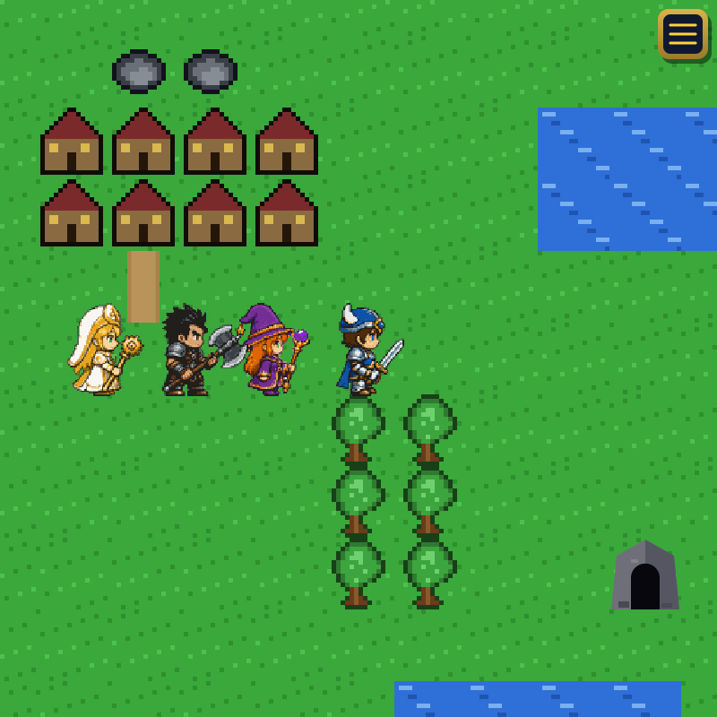
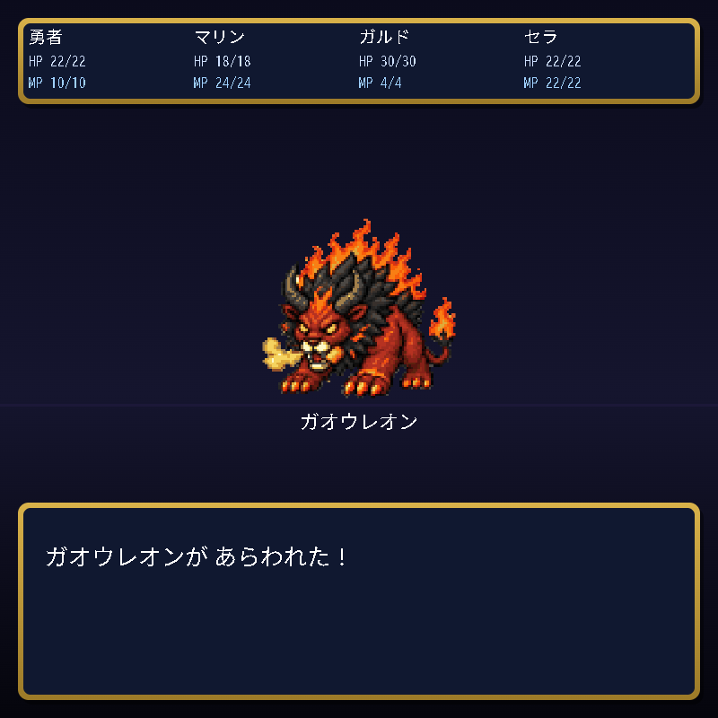
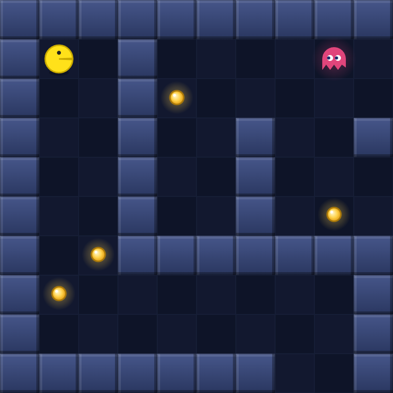
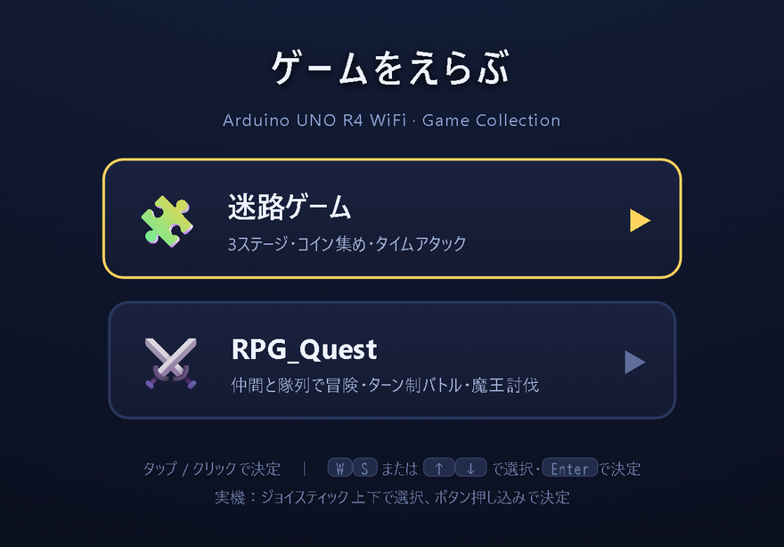
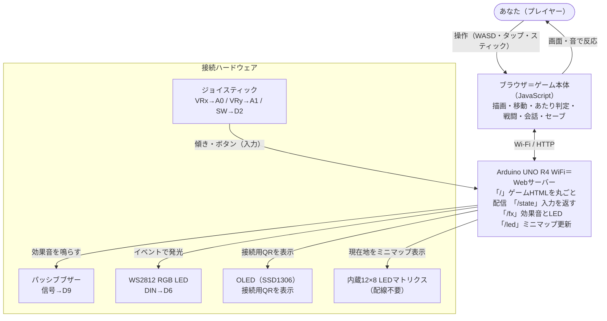
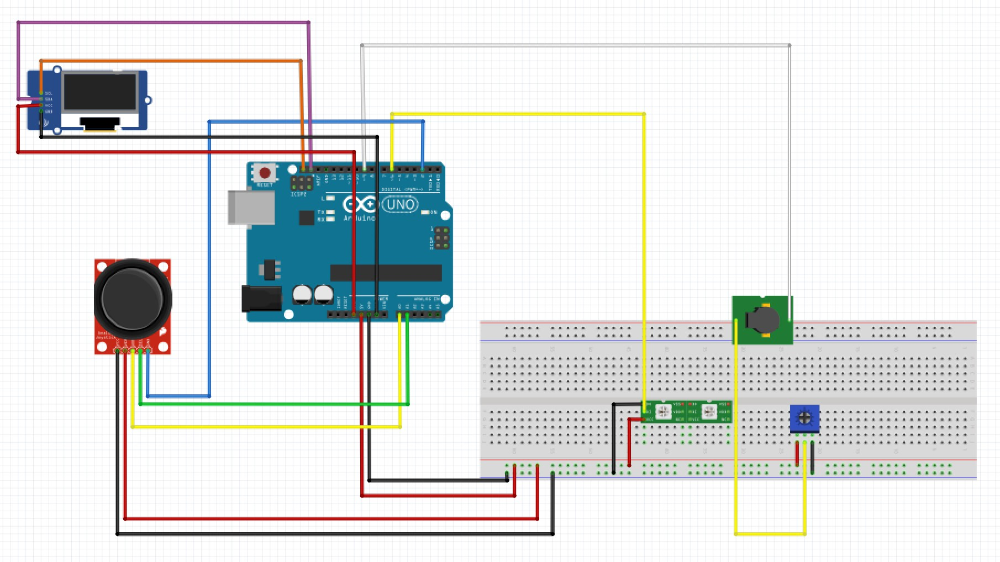
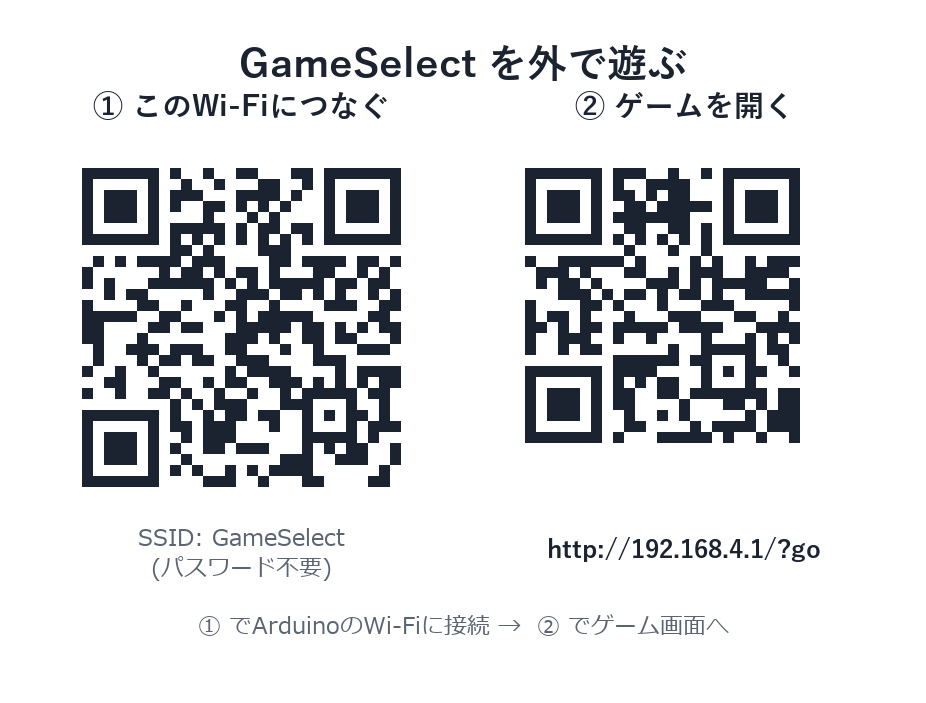

# Graduation-work — Arduino UNO R4 WiFi で動くブラウザゲーム

Arduino UNO R4 WiFi を Web サーバーにして、PC・スマホのブラウザから遊べるゲームを開発しました。

このリポジトリには **2つの作品** と、それらを **1台にまとめて起動時に選べる統合版** が入っています。

| フォルダ | 中身 | 説明 |
|----------|------|------|
| [`MazeGame/`](MazeGame/) | **迷路ゲーム** | ミニゲーム集にしようとして最初に作った迷路ゲーム（完成） |
| [`RPG_Quest/`](RPG_Quest/) | **RPG_Quest** | 迷路の仕組みを土台に発展させたドラクエ風RPG（メイン作品） |
| [`GameSelect/`](GameSelect/) | **統合（ランチャー）** | 起動時に迷路 / RPG を選んで遊べる統合スケッチ |

> 各ゲームの**中身は `MazeGame/` と `RPG_Quest/` で開発**し、`GameSelect/` はその生成物を集めて配信します（更新の置き場所を分離）。
>
> **遊ぶときは `GameSelect/` を書き込めばOK**（迷路もRPGも入っていて、起動時に選べます）。

  
  

  
  

---

## ▶ すぐ遊ぶ（ダウンロード → 書き込むだけ）

`GameSelect/` を書き込めば、**迷路もRPGも1台で**遊べます。
**Wi-Fi設定すら不要**です（`arduino_secrets.h` が無い配布時の状態では、家のWi-Fiへの接続を約12秒試したあと自動でArduino自身のWi-Fi「GameSelect」を立てて起動します）。

### 用意するもの
- **Arduino UNO R4 WiFi** 本体 ＋ **USB-Cケーブル**
- スマホ または PC（ブラウザがあればOK）
- （任意）OLED SSD1306 … 接続用のQRコードを表示するだけ。無くても遊べます

### 1. Arduino IDE の準備（初回だけ）
1. [Arduino IDE](https://www.arduino.cc/en/software) をインストール
2. **ボード**：ボードマネージャで「**Arduino UNO R4 Boards**」を入れる
3. **ライブラリ**：ライブラリマネージャで次の3つを入れる（名前で検索して Install）
   - `Adafruit SSD1306`（依存の `Adafruit GFX Library` も一緒に入ります）
   - `Adafruit NeoPixel`
   - `QRCode`（作者 **Richard Moore** のもの）

### 2. 書き込む
1. このページ右上の緑「**Code ▾ → Download ZIP**」で落として解凍（または `git clone`）
2. `GameSelect/GameSelect.ino` を Arduino IDE で開く
3. **ツール → ボード**＝「Arduino UNO R4 WiFi」、**ポート**を選ぶ
4. **→（書き込み）** ボタンを押す … *Wi-Fi情報の入力は不要です*

### 3. 遊ぶ
1. スマホの**Wi-Fi設定で「GameSelect」**（パスワード無し）に接続
2. 画面が自動で開かないときは、ブラウザで **`http://192.168.4.1`** を開く
3. **ゲーム選択画面**が出る → 迷路 / RPG を選んでプレイ
   - 操作：PCは **WASD / 矢印キー**、スマホは**画面下の仮想十字パッド**（十字＋A/B）やタップ（迷路・RPG共通）

> **家のWi-Fiで使う場合**：`arduino_secrets.h` が無い配布時のままだと、起動のたびに家のWi-Fiへの接続を約12秒試みてから諦め、自動的にArduino自身のアクセスポイント「GameSelect」で起動します。家のWi-Fiに直接つなぎたい場合の手順：
> 1. `arduino_secrets.h.example` を同じフォルダに `arduino_secrets.h` という名前でコピー
> 2. 自分の **2.4GHz** Wi-FiのSSID・パスワードを記入して書き込み
> 3. 起動後、OLEDかシリアルモニタ(9600bps)に出る `192.168.x.x` をブラウザで開く
>
> なお、ジョイスティック端子は未接続でも常に読み取られますが、起動時に中心値を自動でならす仕組み（`calibrateJoystick()`）があるため、繋いでいなくても誤動作しません。

---

## 共通の仕組み（このプロジェクトの肝）

- **ゲームのロジック・描画はすべてブラウザ側の JavaScript**。Arduinoはゲームの中身を一切持たない。
- Arduino は「**Webサーバー**」として、HTMLを配り、ジョイスティックの値を返し、効果音やLEDを鳴らす。**入力（ジョイスティック）・出力（ブザー/LED）・表示（ミニマップ）**の三拍子がそろっている。
- だから重い描画はPC/スマホ側で動き、Arduinoの非力なCPU（48MHz・RAM32KB）を使わずに済む。
- HTMLは **gzip圧縮のまま配信**（ブラウザが自動展開＝マイコンは展開しない）してフラッシュを節約。

詳しい仕組み・操作・配線は、各フォルダの README を参照してください。

---

## 実機ハードウェア

  

> ※図はUNO表記ですが、実機は **Arduino UNO R4 WiFi**（配線は同じ）。

| 部品 | 役割 | 接続 | 使う作品 |
|------|------|------|---------|
| ジョイスティックモジュール | 移動・メニュー操作 | VRx→A0 / VRy→A1 / SW→D2 | 全作品 |
| パッシブブザー ＋ ボリューム | 効果音と音量調整 | 信号→D9 / ブザー→ボリューム→GND（直列） | RPG_Quest / GameSelect |
| WS2812 RGBテープ | イベントに応じて発光 | DIN→D6 | RPG_Quest / GameSelect |
| OLED（SSD1306 128×64） | 接続用QRを表示（外で遊ぶ用） | SDA→SDA / SCL→SCL（I2C・0x3C）, VCC→3.3V, GND→GND | 全作品 |

> 迷路ゲームはブザー・RGBテープを使いません（効果音はブラウザのWeb Audioで再生。OLEDは接続用QR表示に使用）。
> OLEDは要ライブラリ（Adafruit SSD1306 / Adafruit GFX / QRCode）。
> ハードが無くても、キーボード（WASD/矢印）・スマホタップで全機能が動作します。

---

## 開発環境

- ハードウェア: Arduino UNO R4 WiFi / Wi-Fiルーター（2.4GHz帯）/ PC・スマホ
- ソフトウェア: Arduino IDE / HTML・CSS・JavaScript（Canvas API）
- ライブラリ: `WiFiS3`（標準）/ `Adafruit NeoPixel`（RPG_Quest・GameSelect）/ `Adafruit SSD1306`・`Adafruit GFX`・`QRCode`（OLEDのQR表示用）

## スペック

| 項目 | 値 |
|------|----|
| フラッシュ使用率（256KB中） | GameSelect（統合版） 92% |
| RAM使用率（32KB中） | GameSelect（統合版） 38% |
| RPGの配信HTML | 約237KB → **gzip 約122KB** に圧縮して配信 |
| ゲーム規模（RPG） | マップ7・敵12種・仲間3人（最大4人パーティ）・エンディングあり |

## 共通セットアップ

> ※上の「すぐ遊ぶ」（GameSelectのデモモード）なら `arduino_secrets.h` は**不要**です。以下は家のWi-Fiに接続して使う場合。

1. `arduino_secrets.h.example` を **`arduino_secrets.h`** にコピーし、自分のWi-Fi（2.4GHz帯）のSSID・パスワードを記入。
2. 遊びたいフォルダ（`MazeGame/` / `RPG_Quest/` / `GameSelect/`）を Arduino IDE で開き、`arduino_secrets.h` を同じフォルダに置いて書き込み。
3. シリアルモニタ（9600bps）に表示される IP に `http://<IP>/`（httpsではなくhttp）でアクセス。

> `arduino_secrets.h`（実際のWi-Fi情報）は `.gitignore` で除外され、GitHubには公開されません。

---

## 外で遊ぶ（持ち出しプレイ）

家のWi-Fiが無い屋外でも、**`GameSelect` を書き込めばQRを読むだけでゲーム選択画面まで開けます**（Arduino自身がWi-Fiアクセスポイントになる）。

### 手順（外）
1. **`GameSelect/GameSelect.ino` を書き込む**。電源はUSBモバイルバッテリーをUSB-Cに挿すだけ。
2. `arduino_secrets.h` が無い配布時のままなら、電源を入れると約12秒だけ家のWi-Fiを探したあと**自動的にAPが起動**し、OLEDに `Wi-Fi: GameSelect` ＋ QR が表示される。
   （家のWi-Fiで運用している場合は、ジョイスティックのボタンを押しながらリセットすると即AP）
3. スマホで **①のQR** を読む → パスワード不要で「GameSelect」に接続。
4. **②のQR（または `192.168.4.1/?go`）** を読む／開く → **ゲーム選択画面**（迷路 / RPG を選ぶ）。

  

> - **自動で開くこともあります**（キャプティブポータル）：iPhoneは接続直後に自動表示、Androidは「ログイン／サインイン」通知をタップ。ただし**端末・タイミング依存で不安定**なので、**確実なのは手順4**（②のQR か `192.168.4.1/?go`）です。
> - iPhoneの「インターネット未接続」警告は **「このまま接続」** を選ぶ。
> - **近くに家のWi-Fiがあるとスマホがそちらへ戻る**ので、必ず**屋外**で。
> - OLEDに **`Wi-Fi: GameSelect`** と出ていればGameSelectが動いています（`RPG_Quest` 等なら別スケッチを焼いています）。

---

## ライセンス

本リポジトリは研修卒業制作の**成果公開用**です。LICENSE ファイルは付与していません（All rights reserved）。
閲覧・学習目的での参照は歓迎しますが、コード・画像の再配布はご遠慮ください。
