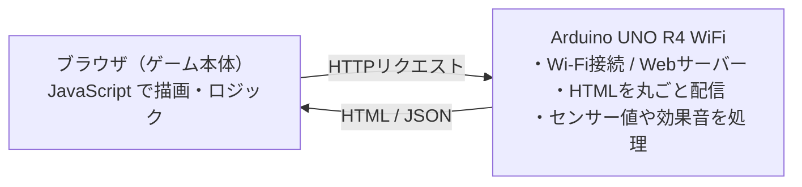

# Graduation-work — Arduino UNO R4 WiFi で動くブラウザゲーム

組み込みエンジニア研修の**卒業制作**。
Arduino UNO R4 WiFi を Web サーバーにして、PC・スマホのブラウザから遊べるゲームを開発しました。

このリポジトリには **2つの作品** と、それらを **1台にまとめて起動時に選べる統合版** が入っています。

| フォルダ | 中身 | 説明 |
|----------|------|------|
| [`MazeGame/`](MazeGame/) | **迷路ゲーム** | 基礎を学ぶために最初に作った迷路ゲーム（完成） |
| [`RPG_Quest/`](RPG_Quest/) | **RPG_Quest** | 迷路の仕組みを土台に発展させたドラクエ風RPG（メイン作品） |
| [`GameSelect/`](GameSelect/) | **統合（ランチャー）** | 起動時に迷路 / RPG を選んで遊べる統合スケッチ |

> 各ゲームの**中身は `MazeGame/` と `RPG_Quest/` で開発**し、`GameSelect/` はその生成物を集めて配信します（更新の置き場所を分離）。

---

## 共通の仕組み（このプロジェクトの肝）

- **ゲームのロジック・描画はすべてブラウザ側の JavaScript**。
- **Arduino は「Webサーバー」**として、HTMLを配り、ジョイスティックの値を返し、効果音やLEDを鳴らす。
- だから重い描画はPC/スマホ側で動き、Arduinoの非力なCPUを使わずに済む。
- HTMLは **gzip圧縮のまま配信**（ブラウザが自動展開＝マイコンは展開しない）してフラッシュを節約。

詳しい仕組み・操作・配線は、各フォルダの README を参照してください。

---

## 実機ハードウェア

| 部品 | 役割 | 接続 | 使う作品 |
|------|------|------|---------|
| ジョイスティックモジュール | 移動・メニュー操作 | VRx→A0 / VRy→A1 / SW→D2 | 全作品 |
| パッシブブザー ＋ ボリューム | 効果音と音量調整 | 信号→D9 / ブザー→ボリューム→GND（直列） | RPG_Quest / GameSelect |
| WS2812 RGBテープ | イベントに応じて発光 | DIN→D6 | RPG_Quest / GameSelect |

> 迷路ゲームはジョイスティックのみ（効果音はブラウザのWeb Audioで再生）。
> ハードが無くても、キーボード（WASD/矢印）・スマホタップで全機能が動作します。

---

## 開発環境

- ハードウェア: Arduino UNO R4 WiFi / Wi-Fiルーター（2.4GHz帯）/ PC・スマホ
- ソフトウェア: Arduino IDE / HTML・CSS・JavaScript（Canvas API）
- ライブラリ: `WiFiS3`（標準）/ `Adafruit NeoPixel`（RPG_Quest・GameSelect）

## 共通セットアップ

1. `arduino_secrets.h.example` を **`arduino_secrets.h`** にコピーし、自分のWi-Fi（2.4GHz帯）のSSID・パスワードを記入。
2. 遊びたいフォルダ（`MazeGame/` / `RPG_Quest/` / `GameSelect/`）を Arduino IDE で開き、`arduino_secrets.h` を同じフォルダに置いて書き込み。
3. シリアルモニタ（9600bps）に表示される IP に `http://<IP>/`（httpsではなくhttp）でアクセス。

> `arduino_secrets.h`（実際のWi-Fi情報）は `.gitignore` で除外され、GitHubには公開されません。

---

## 外で遊ぶ（持ち出しプレイ）

家のWi-Fiが無い屋外でも、**Arduino自身がWi-Fiアクセスポイント(AP)になる**ので単体で遊べます。

- **電源**：USBモバイルバッテリーをUSB-Cに挿すだけ（基板にもArduino経由で給電。別の電源モジュール不要）。
- **接続**：起動時にルーターが見つからなければ**自動でAPモード**（ジョイスティックのボタンを押しながらリセットで即AP）。スマホをQRでつなぐだけ。
- 各スケッチのAP名はフォルダ名（`MazeGame` / `RPG_Quest` / `GameSelect`）。下のQRは**統合版(GameSelect)**用です。

  

| 手順 | 内容 |
|------|------|
| ① | スマホのカメラで左のQRを読み、Wi-Fi **`GameSelect`**（パスワード `gameselect`）に接続 |
| ② | 右のQRを読み、`http://192.168.4.1/` を開く → ゲーム選択画面 |
