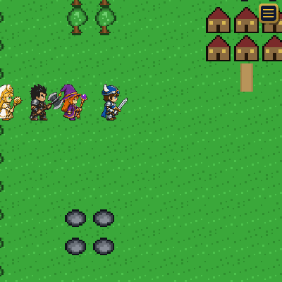
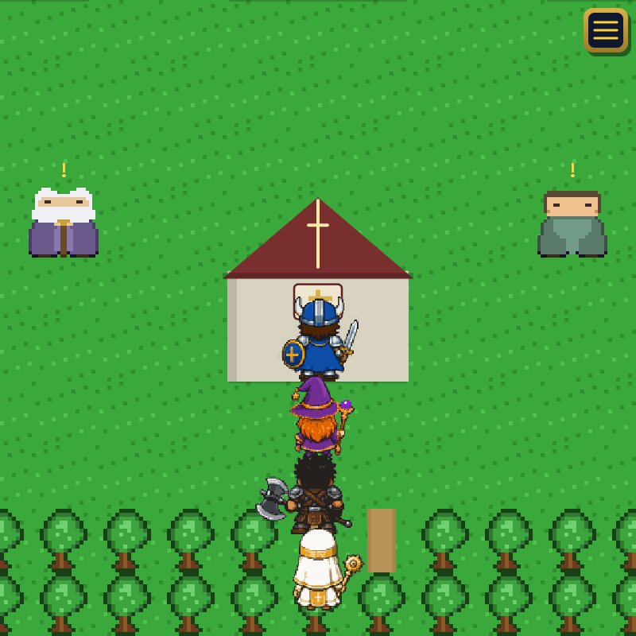
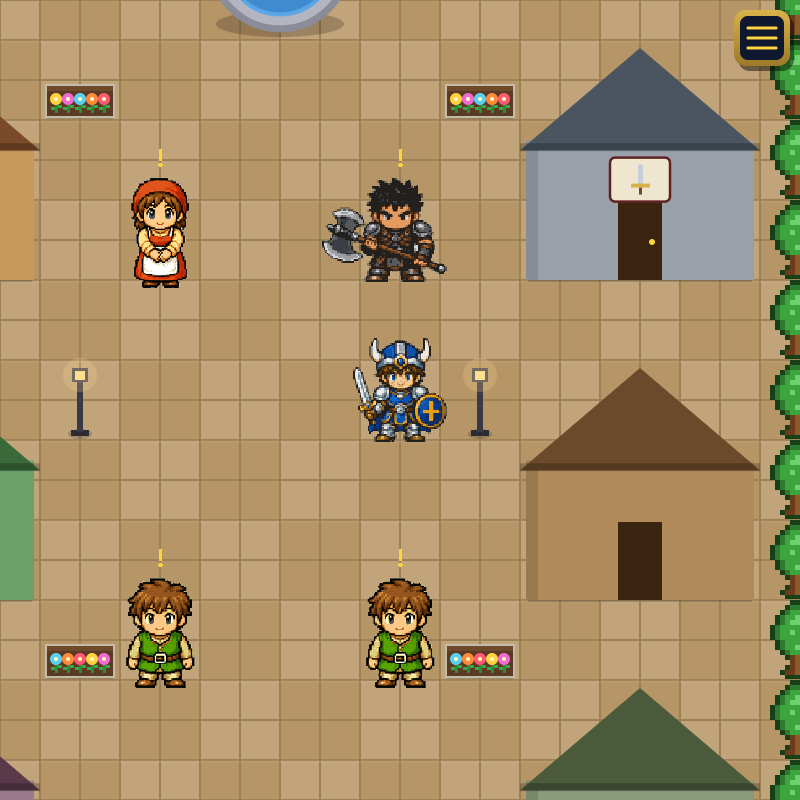
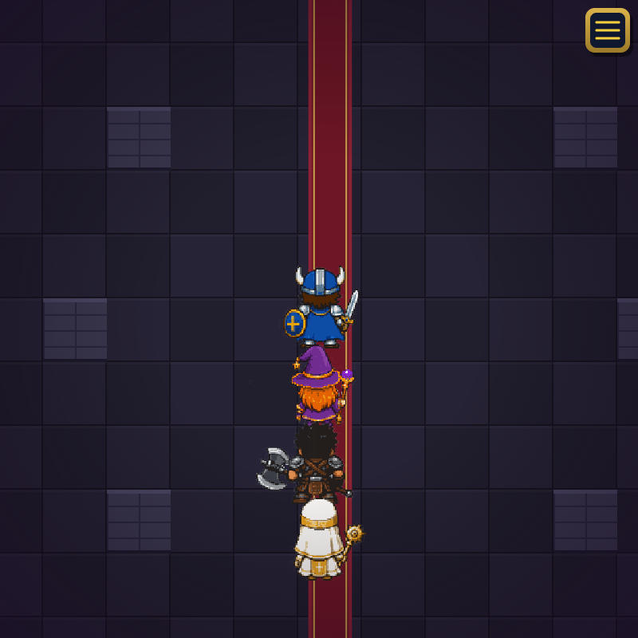
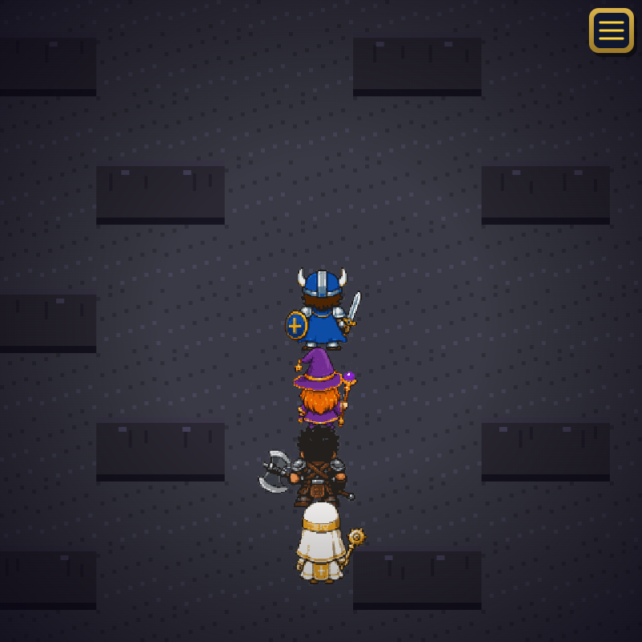
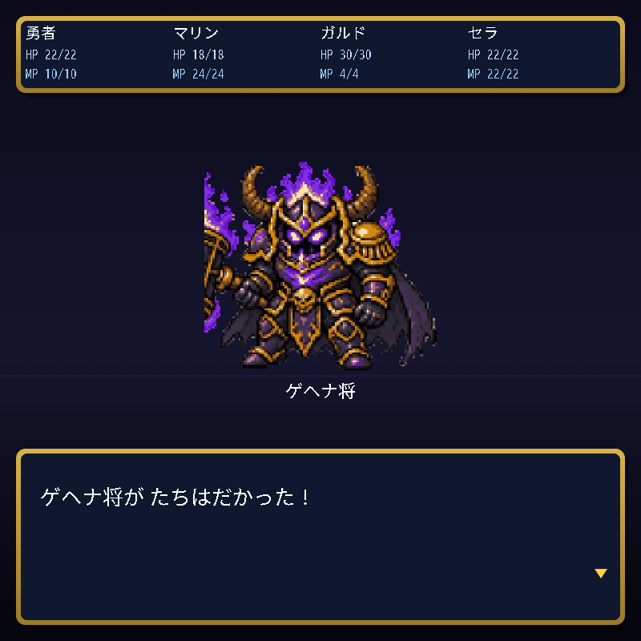
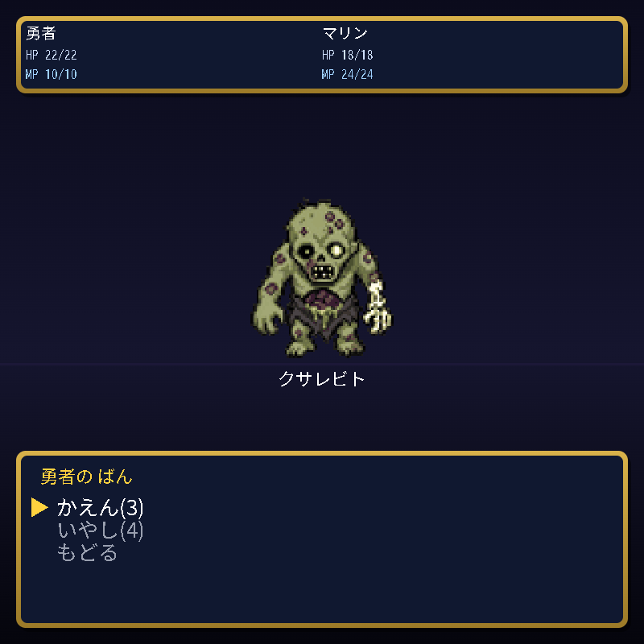
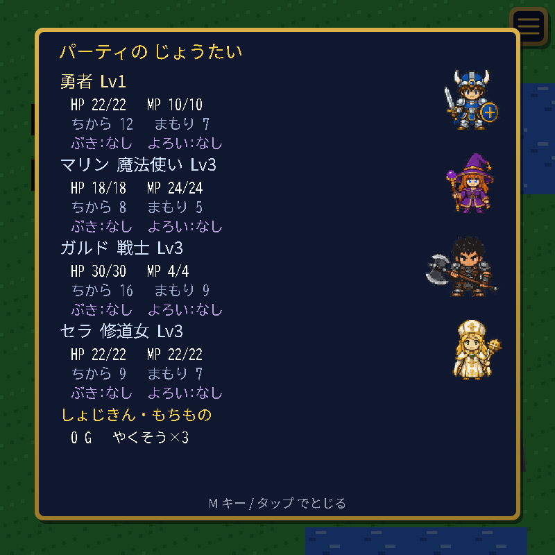
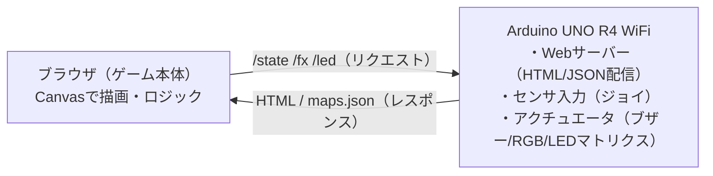

# RPG_Quest（ドラクエ風ブラウザRPG）

Arduino UNO R4 WiFi を **Webサーバー**にして、PC・スマホのブラウザから遊べる **ドラクエ風RPG**。
組み込みエンジニア研修の卒業制作のメイン作品です。

ゲーム本体（描画・ロジック）はブラウザ側の JavaScript（Canvas）。Arduino は HTML/データを配信し、ジョイスティック値を返し、ブザー・LED・内蔵LEDマトリクスを制御します。

  

---

## スクリーンショット

### 仲間が隊列で追従するフィールド探索
4人パーティ（勇者・マリン・ガルド・セラ）が、向き（前・後・左・右）に応じた4方向ドット絵で隊列を組んで歩きます。

  
  
  

街・洞窟・エリア・奥の町・魔王城など、テーマの違う世界を冒険できます。

  

### ターン制バトル
場所ごとに出る敵が変わり（フィールド→道で強くなる）、属性（火/氷）の弱点・耐性、特技・呪文を駆使して戦います。洞窟最奥には関門の**中ボス**。

  
  
  

### パーティのステータス
各メンバーの立ち絵・HP/MP・能力・装備を確認できます。

  

---

## 主な機能

### フィールド・パーティ
- ドット絵マップを4方向に移動・カメラ追従（歩行アニメつき）
- **仲間が隊列で追従**（勇者の移動履歴をたどる「足跡(trail)」方式）
- **仲間加入イベント**：東の洞窟で魔法使いマリンを救出／奥の町の大聖堂でシスター セラが加入
- NPCと会話（1文字送りの会話ウィンドウ）

### 世界・街
- 街（魔物が出ない安全地帯）に4施設：宿屋（HP/MP全回復＋セーブ）／武器屋／道具屋／教会（復活地点設定＋回復）
- テーマの違うマップ：最初の街・東の洞窟・エリア・奥の町（大聖堂）・魔王城への道・魔王城
- マップは `/maps.json` でデータ配信（データ駆動。マップを増やしてもプログラム本体は変えずに済む）

### 戦闘（ターン制コマンド）
- 草地・洞窟・道でランダムエンカウント → 一人称視点バトル
- コマンド：たたかう／とくぎ／じゅもん／どうぐ／にげる（職業ごとの特技・呪文）
- **属性**：弱点1.5倍／耐性0.5倍。ダメージ計算・敵の反撃・経験値/ゴールド・**レベルアップ**
- **敵6体＋中ボス**を場所別エンカウント表で出し分け（難易度カーブ）。中ボスは洞窟最奥の関門
- 全滅すると教会（リスポーン地点）で復活

### 装備・セーブ
- 武器＝攻撃力、鎧＝守備力が戦闘に反映（職業別の装備制限）
- localStorage でセーブ／ロード（宿屋・教会で保存）

### 実機ハードウェア連携
- **ジョイスティック**で移動・メニュー操作
- **パッシブブザー＋ボリューム**でイベント効果音と音量調整
- **WS2812 RGBテープ**でイベント発光（攻撃=赤／回復=緑／レベルアップ=金 など）
- **本体内蔵 12×8 LEDマトリクス**を**ミニマップ**に（現在地・出入口・建物を点で表示。自機の点滅はArduino側で自走）

---

## 操作

| | 移動 | 決定・話す | メニュー |
|---|------|-----------|---------|
| PC | WASD / 矢印 | Space / Enter | M キー |
| スマホ | タップ | タップ | 右上ボタン |
| 実機 | ジョイスティック | ボタン押し込み | — |

> ハードが無くてもキーボード・タップで全機能動作します。

---

## 仕組み（HTTP通信）

ブラウザと Arduino は次の通信をします。**入力・出力・表示**の三系統がそろっています。

| パス | 向き | 内容 |
|------|------|------|
| `/`（その他） | ブラウザ ← Arduino | ゲームのHTMLを配信（大きいので1KBずつ確実に送信） |
| `/maps.json` | ブラウザ ← Arduino | マップデータをJSONで配信（起動時に取得） |
| `/state` | ブラウザ → Arduino | ジョイスティックの値を JSON で取得（定期ポーリング・**入力**） |
| `/fx?s=...` | ブラウザ → Arduino | イベント時にブザー＋RGB LED（**出力**） |
| `/led?...` | ブラウザ → Arduino | 内蔵LEDマトリクスのミニマップへ反映（**表示**） |

---

## 配線（実機で遊ぶ場合）

| 部品 | Arduino | 備考 |
|------|---------|------|
| ジョイスティック VRx / VRy / SW | A0 / A1 / D2 | VCC→5V, GND→GND |
| パッシブブザー（+） | D9 | (−)→ボリューム中央→外側→GND（直列＝音量調整） |
| WS2812 DIN | D6 | 5V→5V, GND→GND |
| 内蔵 12×8 LEDマトリクス | （本体内蔵） | 追加配線なし |

> WS2812を使うため、Arduino IDE で **Adafruit NeoPixel** ライブラリの導入が必要です。

---

## ビルド

1. リポジトリ直下の `arduino_secrets.h.example` を `arduino_secrets.h` にコピーし、このフォルダ（`RPG_Quest/`）に置いて Wi-Fi（2.4GHz帯）情報を記入。
2. `RPG_Quest.ino` / `webpage.h` / `maps.h` / `arduino_secrets.h` を同じフォルダに置く。
3. **Adafruit NeoPixel** を導入し、Arduino IDE で書き込む。
4. シリアルモニタ（9600bps）に表示される IP に `http://<IP>/`（httpsではなくhttp）でアクセス。

詳細はリポジトリ直下の [README](../README.md) を参照。

---

> スクリーンショットはすべて本作のゲーム画面（自作）です。
